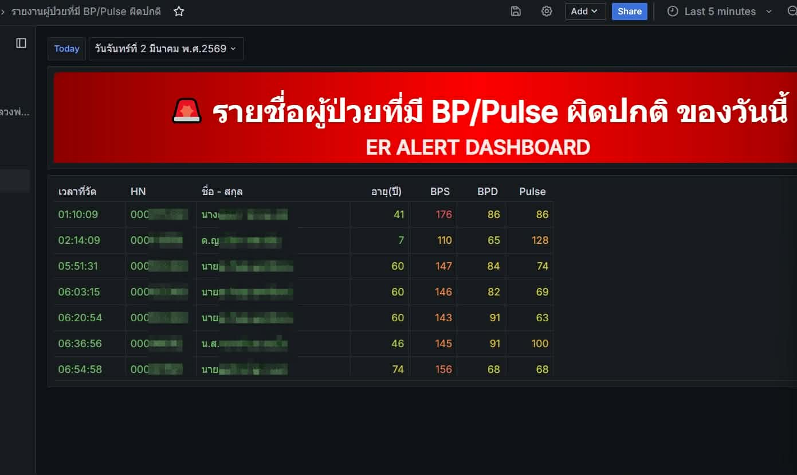
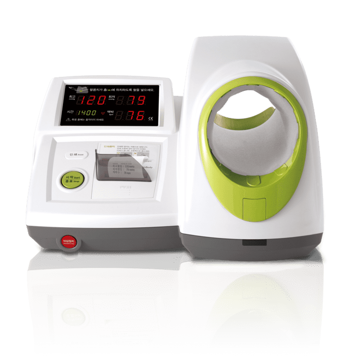

## Mini project: AI Model for Re-Triage Prediction  นายสามารถ จำรัส รหัส 6810038288

## 1) สภาพปัญหา
ในระบบคัดกรองผู้ป่วยฉุกเฉิน ผู้ป่วยจะถูกประเมินระดับความเร่งด่วนครั้งแรกแล้วเข้าสู่กระบวนการรอตรวจหรือรอพบแพทย์ อย่างไรก็ตาม ระหว่างรออาการของผู้ป่วยอาจเปลี่ยนแปลงได้ โดยเฉพาะในรายที่มีสัญญาณชีพเริ่มผิดปกติหรือมีแนวโน้มทรุดลง แต่ยังไม่ถึงระดับที่เห็นได้ชัดจากการดูค่าเพียงครั้งเดียว แม้โรงพยาบาลจะมีเครื่องวัดสัญญาณชีพอัตโนมัติและมีข้อมูลอยู่ใน HIS แล้ว แต่การติดตามผู้ป่วยที่ควรได้รับการประเมินซ้ำยังอาศัยการสังเกต การไล่ดูตัวเลข หรือการตัดสินใจของบุคลากรเป็นหลัก ทำให้ผู้ป่วยบางรายที่ควรได้รับ re-triage อาจยังอยู่ในคิวเดิม ส่งผลให้การเข้าถึงการรักษาล่าช้าและเพิ่มความเสี่ยงต่อความไม่ปลอดภัยของผู้ป่วย

## 2) วัตถุประสงค์
1. เพื่อพัฒนาระบบ AI ช่วยประเมินความเสี่ยงของผู้ป่วยระหว่างรอใน ER จากข้อมูลสัญญาณชีพ เวลารอ และข้อมูลคัดกรองเบื้องต้น  

## 3) สถานการณ์ปัจจุบัน
ระบบเดิมใช้เครื่องวัดสัญญาณชีพอัตโนมัติในหน่วยงาน เช่น เครื่องวัดความดันโลหิตและชีพจร ซึ่งส่งข้อมูลเข้าสู่ระบบ HIS ของโรงพยาบาล จากนั้นมีการดึงข้อมูลจากฐานข้อมูลมาสร้าง dashboard สำหรับติดตามผู้ป่วยที่มีค่า BP/Pulse ผิดปกติแบบ real-time

คุณลักษณะของระบบเดิม ได้แก่  
- รับข้อมูลจากอุปกรณ์วัดสัญญาณชีพอัตโนมัติ  
- จัดเก็บข้อมูลในฐานข้อมูลของโรงพยาบาลผ่าน HIS  
- แสดงรายชื่อผู้ป่วยที่มีค่า BP/Pulse ผิดปกติ  
- มีการใช้สีหรือแถบสถานะเพื่อช่วยติดตามสถานการณ์  
- เน้นการมองเห็นค่าผิดปกติ ณ เวลาปัจจุบัน

## 4) พิจารณาต่อยอดด้วย AI
การต่อยอดด้วย AI จะเปลี่ยนบทบาทของระบบจาก “ระบบเฝ้าดูข้อมูล” ไปสู่ “ระบบช่วยตัดสินใจ” โดยวิเคราะห์ข้อมูลหลายมิติร่วมกัน เช่น  
- ค่าสัญญาณชีพล่าสุด  
- แนวโน้มของสัญญาณชีพก่อนหน้า  
- ระยะเวลาที่ผู้ป่วยรอ  
- ระดับความเร่งด่วนเดิม  
- ปัจจัยเสี่ยงพื้นฐานของผู้ป่วย  
- อาการสำคัญหรือเหตุผลที่มารับบริการ  

จากนั้น AI จะสร้างคำแนะนำเชิงปฏิบัติ เช่น  
- **Continue waiting** : ยังสามารถรอต่อได้  
- **Observe closely** : ควรเฝ้าระวังใกล้ชิดหรือวัดซ้ำเร็วขึ้น  
- **Re-triage now** : ควรประเมินซ้ำทันที  

ประโยชน์ของโมเดลนี้คือช่วยตอบคำถามที่ระบบเดิมยังตอบไม่ได้ เช่น  
- ผู้ป่วยรายนี้ควรถูกประเมินซ้ำตอนนี้หรือยัง  
- ผู้ป่วยรายนี้ควรถูกเปลี่ยนสถานะจากเขียวเป็นเหลืองหรือไม่  
- แม้ค่า BP/Pulse ยังไม่วิกฤต แต่เมื่อรวมเวลารอและแนวโน้มก่อนหน้าแล้ว มีความเสี่ยงเพิ่มขึ้นหรือไม่  

## 5) ข้อมูลที่ใช้มีลักษณะเป็นอย่างไร
ข้อมูลที่ใช้มีลักษณะเป็น **ข้อมูลเชิงตารางร่วมกับข้อมูลเชิงเวลา** โดยเป็นข้อมูลที่เกิดขึ้นต่อเนื่องตามลำดับเหตุการณ์ของผู้ป่วยแต่ละราย

### กลุ่มข้อมูลหลัก
**1. ข้อมูลประชากรพื้นฐาน**  
เช่น อายุ เพศ สิทธิการรักษา หรือข้อมูลพื้นฐานอื่นที่เกี่ยวข้องกับความเสี่ยง

**2. ข้อมูลคัดกรองเบื้องต้น**  
เช่น triage level เดิม, chief complaint, เวลา check-in, เวลา triage

**3. ข้อมูลสัญญาณชีพ**  
เช่น BP systolic, BP diastolic, pulse  
และถ้ามีเพิ่มได้จะยิ่งดี เช่น RR, SpO₂, temperature, consciousness level

**4. ข้อมูลเชิงเวลา**  
เช่น เวลาวัดแต่ละครั้ง, waiting time, เวลาตั้งแต่ triage ครั้งแรก, จำนวนครั้งที่วัดซ้ำ

**5. ข้อมูลผลลัพธ์**  
เช่น เคยถูก re-triage หรือไม่, ถูกเลื่อนระดับความเร่งด่วนหรือไม่, ได้รับการประเมินโดยแพทย์เร็วขึ้นหรือไม่, admit, refer หรือ outcome อื่นที่ใช้เป็น label ในการพัฒนาโมเดล

## 6) Model

ในการทดลองนี้เลือกใช้โมเดล Deep Learning จำนวน 2 รูปแบบ ได้แก่ **1D-CNN** และ **GRU** เนื่องจากข้อมูลที่ใช้เป็นข้อมูลสัญญาณชีพแบบลำดับเวลา โดยผู้ป่วยแต่ละรายมีการวัดซ้ำหลาย time steps เช่น ความดันโลหิต ชีพจร อัตราการหายใจ ค่า SpO₂ และอุณหภูมิร่างกาย

### 1. 1D-CNN

**1D-CNN** หรือ **One-Dimensional Convolutional Neural Network** เป็นโมเดลที่ใช้ชั้น `Conv1D` ในการเรียนรู้ pattern ของข้อมูลที่เรียงตามลำดับ เช่น time-series data หรือข้อมูลสัญญาณชีพที่ถูกวัดซ้ำตามเวลา

### 2. GRU

**GRU** หรือ **Gated Recurrent Unit** เป็นโมเดลในกลุ่ม Recurrent Neural Network ที่ออกแบบมาเพื่อเรียนรู้ข้อมูลลำดับเวลา โดยสามารถจดจำข้อมูลจาก time steps ก่อนหน้าและนำมาใช้ประกอบการทำนายผลลัพธ์ปัจจุบัน

### รูปแบบ output ของ model
เป็น Probability score เช่น 0.0–1.0 ว่าควร re-triage หรือไม่ โดยแบ่งเป็น 3 ประเภท
โมเดลให้ผลลัพธ์เป็น probability score ของแต่ละ class โดยใช้ `softmax` activation function ใน output layer ซึ่งประกอบด้วย 3 class ได้แก่

- `continue_waiting` : ผู้ป่วยยังสามารถรอต่อได้
- `observe_closely` : ควรเฝ้าระวังใกล้ชิดหรือวัดซ้ำเร็วขึ้น
- `re_triage_now` : ควรได้รับการประเมินซ้ำทันที
